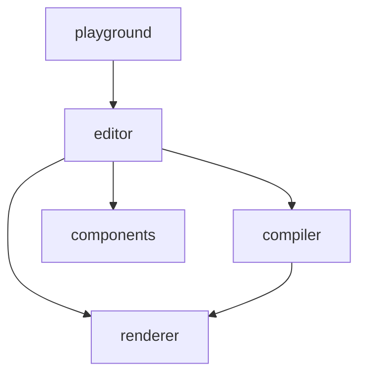

# 低代码平台项目锐评

## 一、项目概览

这是一个 **JSON Schema 驱动的低代码平台**，采用 pnpm monorepo 架构，包含 5 个核心包和 1 个示例应用：

| 包名         | 定位                | 核心技术                 |
| ------------ | ------------------- | ------------------------ |
| `renderer`   | 运行时渲染引擎      | React 18 + Redux Toolkit |
| `components` | UI 组件库           | Ant Design 5 封装        |
| `compiler`   | Schema → 代码编译器 | 纯 TS 代码生成           |
| `editor`     | 可视化编辑器        | Monaco Editor + AI 辅助  |
| `server`     | 后端 AI 服务        | NestJS + 多 AI Provider  |

**技术栈全景**：React 18 · TypeScript · Ant Design 5 · Vite · Redux Toolkit · Monaco Editor · NestJS · Anthropic/OpenAI/Ollama

---

## 二、架构分析

### 2.1 Monorepo 结构

采用 pnpm workspace 管理多包，结构清晰，包的划分遵循 **关注点分离** 原则。依赖关系为：

> [!TIP]
> 包之间的依赖方向清晰，没有循环依赖，这是一个好的架构决策。

**问题点**：`examples/playground` 没有被纳入 `pnpm-workspace.yaml` 的 `packages` 配置中，意味着它不享受 workspace 协议的好处，可能导致依赖管理上的不一致。

### 2.2 Schema 设计（A2UI Format）

项目采用了 **扁平化组件树（Flat Schema）** 的设计：通过 `rootId` 指定根节点，`components` 为一个扁平的 ID → Component 映射，每个组件通过 `childrenIds` 引用子节点。

**优点**：

- 扁平结构使得组件查找为 O(1)，避免了深度嵌套的递归遍历
- 便于实现组件的拖拽、移动、复制等编辑操作
- 天然支持组件引用和共享

**不足**：

- `A2UISchema` 类型定义中大量使用 `any` （如 `props: Record<string, any>`），丧失了类型安全的核心价值
- 缺少 Schema 版本控制机制（`version` 字段），未来 Schema 格式升级时缺乏迁移策略
- 未定义 JSON Schema 验证规则（如 JSON Schema Draft 7），完全依赖运行时校验

### 2.3 DSL 执行引擎

这是整个项目最有技术深度的部分。`renderer` 包内置了一个完整的 **DSL 执行引擎**，支持：

| Action 分类 | 包含操作                                      | 说明           |
| ----------- | --------------------------------------------- | -------------- |
| 数据操作    | setField, mergeField, clearField              | 表单数据管理   |
| UI 交互     | message, modal, confirm, notification         | 用户反馈       |
| 导航        | navigate, openTab, closeTab, back             | 路由控制       |
| 状态管理    | dispatch, setState, resetForm                 | Redux 集成     |
| 异步操作    | apiCall, delay, waitCondition                 | 网络请求与异步 |
| 流程控制    | condition, loop, parallel, sequence, tryCatch | 业务编排       |
| 调试        | log, debug                                    | 开发辅助       |

**亮点**：

- 采用 **注册表模式**（ActionRegistry），可扩展自定义 Action
- 执行上下文（ExecutionContext）设计丰富，内置了 http 工具、uuid、debounce/throttle 等实用方法
- 支持嵌套 Action（如 tryCatch 内的 onError、apiCall 的 onSuccess/onError）

**隐患**：

- DSL 类型定义文件（`dsl.ts`）长达 550+ 行，所有 Action 类型堆在一个文件中，维护成本高
- `ExecutionContext` 接口包含约 100 行的属性定义，职责过于庞大，违反了接口隔离原则
- 流程控制 Action（如 loop）的无限循环风险仅靠外部约束，缺少引擎层面的安全限制

---

## 三、安全性分析

### 3.1 表达式解析器

表达式解析器（`expressionParser.ts`）是安全性的关键节点：

**已做的安全措施**：

- 实现了 Proxy 沙箱（`createSandbox`），拦截对全局对象的访问
- 有静态安全校验（`validateSafety`），拦截 `eval`、`Function`、`import` 等危险操作
- 使用 `with` 语句 + Proxy 的 `has` trap 实现变量隔离

**仍存在的风险**：

- 底层仍使用 `new Function()` 执行动态代码，这是一个根本性的安全隐患
- 黑名单式的安全校验容易被绕过（如通过字符串拼接、Unicode 编码等方式）
- 根据历史对话记录，此安全问题已被识别并计划修复，但尚未完全解决

> [!CAUTION]
> 表达式引擎使用 `new Function()` 动态执行用户输入，即使有 Proxy 沙箱保护，仍然是**最高优先级的安全风险**。建议考虑采用白名单 AST 解析器替代。

### 3.2 服务端安全

- NestJS 服务配置了全局 `ValidationPipe`（whitelist + forbidNonWhitelisted），DTO 验证严格
- 配置了 `HttpExceptionFilter` 统一异常处理
- 配置了 `@nestjs/throttler` 限流中间件
- CORS 默认配置为 `origin: '*'`，生产环境需要收紧
- `.env` 文件（4KB）直接存在于版本控制中，存在 API Key 泄露风险

---

## 四、AI 集成分析

### 4.1 架构设计

AI 集成经历了关键重构，当前采用清晰的**单向调用架构**：

- **前端层**（Editor 包）：作为纯粹的 API 客户端（`ServerAIService`），负责管理模型配置的用户交互，并向后端发起请求。
- **后端层**（Server 包）：NestJS 服务作为统一的 AI 能力核心，使用工厂模式（`AIProviderFactory`）管理多个 Provider。

**客户端界面迭代**：进一步重新设计了 AI 助手的界面和功能（包含了对话面板和配置界面的交互升级），提供了更好的开发体验，API 请求被完全收敛至前端统一的服务层。

> [!TIP]
> 前端已移除了直接调用大模型 API 的冗余逻辑，**彻底消除了浏览器端暴露 API Key 的严重安全隐患**。前后端职责划分回归了标准且安全的 Web 架构范式。

### 4.2 Provider 工厂设计

后端的 `AIProviderFactory` 设计较为成熟：

- 支持三大主流 Provider（OpenAI、Anthropic、Ollama）
- 支持自定义 Provider 注册（默认基于 OpenAI 兼容接口）
- 提供健康检查、热重载、状态查询等运维能力
- 使用 RxJS Observable 实现流式输出

### 4.3 不足之处

- 缺少 fallback 机制（当首选 Provider 不可用时，不会自动无缝切换到备选）
- 没有 token 计费、配额管理、对话历史持久化等生产级企业功能
- AI 生成的 Schema 缺少严谨的结构化验证层（如 Zod），系统过度信任 AI 的输出结构

---

## 五、组件库分析

### 5.1 组件覆盖度

封装了 **31 个 Ant Design 组件** + 若干子组件，覆盖了布局、表单、数据展示、反馈四大类，基本满足中后台场景需求。

### 5.2 设计问题

- **同时声明了 `dependencies` 和 `peerDependencies` 中的 `react` 和 `antd`**：这可能导致多实例问题，应只保留 `peerDependencies`
- 组件注册表（`componentRegistry`）使用硬编码方式，每新增一个组件都需要修改 `index.tsx` 中的两处（export 和 registry），容易遗漏
- 所有组件都用 `any` 作为 props 类型在注册表中注册（`Record<string, React.ComponentType<any>>`），丧失了运行时的类型提示
- 缺少组件的 **属性元数据**（propertyPanel schema），无法在可视化编辑器中动态生成属性配置面板

---

## 六、编译器分析

`compiler` 包将扁平化的 A2UI Schema 编译为 React 组件源代码。

**亮点**：

- 利用扁平结构的特性进行全局状态收集（一次遍历提取所有 useState）
- 支持 Field 双向绑定的代码生成
- 内置样式编译器，可将内联样式提取为 CSS className

**局限**：

- 只有 4 个源文件，功能相对基础
- 生成的代码硬编码了 `antd` 和 `React` 的 import，不支持其他 UI 框架
- 不支持 TypeScript 代码生成（只生成 JSX）
- 事件处理的编译逻辑过于简化（目前仅支持 `submit` 一种事件绑定）
- 未接入 Prettier 等格式化工具（虽然接口预留了 `prettier` 选项但未实现）

---

## 七、测试覆盖度

| 包         | 测试框架 | 测试状态                                                         | 状态        |
| ---------- | -------- | ---------------------------------------------------------------- | ----------- |
| renderer   | Vitest   | 具备完整的单元测试（覆盖引擎、各类 Action 及解析器）             | ✅ 覆盖完备 |
| server     | Jest     | 已完善 AI 模块测试覆盖率（涵盖工厂、控制、服务等并修复安全漏洞） | ✅ 覆盖完善 |
| compiler   | Vitest   | 新增核心代码生成器的基础功能与逻辑测试                           | ✅ 覆盖基础 |
| components | Vitest   | 新增组件注册中心与基础自定义 UI 组件的渲染测试                   | ✅ 覆盖基础 |
| editor     | Vitest   | 新增编辑器加载状态与核心页面组件的渲染 Mock 测试                 | ✅ 覆盖基础 |

> [!NOTE]
> **关于测试框架不统一（Vitest vs Jest）：**
> 前端（`renderer`）使用 Vite，天然契合 `Vitest`；后端（`server`）使用 NestJS，官方默认深度绑定 `Jest`。在全栈 Monorepo 中，保留各自生态的默认最佳实践是完全可以接受的。
> 如果团队希望降低心智负担并追求极致测试速度，可以考虑将后端也统一迁移到 `Vitest`（配置SWC）。但在当前阶段，**核心矛盾是“没有测试”（特别是 compiler），而不是“测试框架不统一”**，建议暂不折腾框架迁移，先补齐测试用例。

> [!IMPORTANT]
> renderer 的测试覆盖了最关键的 DSL 引擎、表达式解析器和安全沙箱，这是正确的优先级。但 compiler 作为代码生成器零测试是较大的风险点——生成的代码正确性完全靠人工验证。

---

## 八、开发体验（DX）

### 8.1 做得好的方面

- `AGENT.md` 文件非常详尽（208 行），为 AI 辅助开发提供了充足的上下文
- `tsconfig.base.json` 配置了严格模式（`strict: true`、`noUnusedLocals`、`noUnusedParameters`）
- 支持 `pnpm dev` 一键启动 playground
- 构建脚本设计合理，支持单包和全量构建

### 8.2 有待改进

- 缺少 ESLint/Prettier 配置（根目录和各包都没有 `.eslintrc`）
- 没有 `.editorconfig` 文件统一编辑器格式
- 缺少 Git Hooks（如 husky + lint-staged）保障提交质量
- 没有 CI/CD 配置（GitHub Actions / GitLab CI 等）
- `README.md` 中的 Schema 格式说明与实际代码中的 A2UI 扁平格式 **不一致**（README 描述的是嵌套树结构，而代码使用的是扁平结构）

---

## 九、可扩展性与可维护性

### 9.1 扩展性

- ✅ 组件注册表支持自定义组件注入
- ✅ DSL Action 支持自定义处理器注册
- ✅ AI Provider 支持自定义扩展
- ❌ 缺少插件系统或微内核架构
- ❌ 没有支持主题定制的机制（除了 Ant Design 自带的 ConfigProvider）
- ❌ 编译器不支持多目标输出（如 Vue、小程序等）

### 9.2 可维护性

- 代码注释使用中文，且覆盖率较高，团队内可读性好
- 类型定义较完整，但 `any` 使用过于频繁
- 部分文件过长（如 `dsl.ts` 552 行、`Renderer.tsx` 443 行、`expressionParser.ts` 422 行），建议拆分

---

## 十、总结

### ⭐ 核心优点

1. **架构设计合理** — Monorepo + 分包策略清晰，包之间依赖方向正确，关注点分离做得好
2. **DSL 引擎功能丰富** — 支持 7 大类 20+ 种 Action，具备流程控制、异步操作、错误处理等高级能力，远超一般低代码平台
3. **扁平化 Schema 设计** — 比嵌套树结构更适合低代码场景的编辑操作，O(1) 组件查找效率高
4. **AI 架构重构及时** — 迅速移除了前端直连大模型的不安全设计，统一收口至后端，提升了系统安全性和架构一致性
5. **代码质量基线** — TypeScript strict 模式、完善的中文注释、合理的模块划分

### ⚠️ 核心问题

1. **安全隐患残留** — 表达式引擎底层仍使用 `new Function()` 执行动态代码，目前的 `Proxy + with` 沙箱加上黑名单机制，能防君子但防不了恶意绕过
2. **工程化与安全风险** — 表达式引擎的 `new Function()` 沙箱仍有绕过风险；且当前缺少统一的代码校验和强制门禁机制，需建设 Lint 与 CI。
3. **类型安全形同虚设** — 核心数据结构和组件注册表大量使用 `any`，TypeScript 的静态检查价值被大幅削弱
4. **工程化极简主义** — 无 Lint、无统一格式化、无 Git Hooks、无 CI/CD，长期的团队协作质量难以保障
5. **文档与代码脱节** — README 描述的 Schema 格式与实际基于扁平化 A2UI 的实现存在割裂，增加接入认知成本

### 📊 综合评分

| 维度       | 评分 (1-10) | 说明                                                                              |
| ---------- | :---------: | --------------------------------------------------------------------------------- |
| 架构设计   |    **8**    | 分层清晰，AI 架构已重构向标准模式                                                 |
| 功能完整度 |    **7**    | DSL 引擎强悍，编译器基础但可用                                                    |
| 代码质量   |    **6**    | 注释详尽，但受限于 `any` 的过度使用                                               |
| 安全性     |    **6**    | API Key 隐患已除，但动态表达式沙箱仍有风险                                        |
| 测试覆盖   |   **7.5**   | 基础测试基建全覆盖，各包均具备一定量的核心逻辑与渲染的单元测试                    |
| 工程化     |    **3**    | 基建几乎全无，严重依赖工程师自觉                                                  |
| AI 集成    |    **8**    | 架构优化后职责清晰，支持多模型流式输出                                            |
| 开发体验   |    **7**    | 上下文管理优秀 (`AGENT.md`)，但缺代码检查工具                                     |
| **综合**   |   **7.0**   | **核心架构扎实且在持续进化的优质项目，接下来的重点应放在消除 `any` 与建设工程化** |

### 🎯 优先改进建议

1. **P0 — 安全深水区**：彻底废除 `new Function()`，引入或自研真正的白名单 AST 解析引擎（如基于 JS-Interpreter）。
2. **P1 — 类型攻坚战**：逐步剔除 `any`，为组件 props 定义精确的 TypeScript 接口，同时引入 Zod 构建严密的运行时校验。
3. **P2 — 补充自动化流**：目前已建立各包基础测试覆盖，下一步重点是接通 CI（GitHub Actions）实现合并主分支的防劣化校验。
4. **P2 — 研发基建**：花半天时间引入 ESLint + Prettier + husky + lint-staged，终结代码风格争议。
