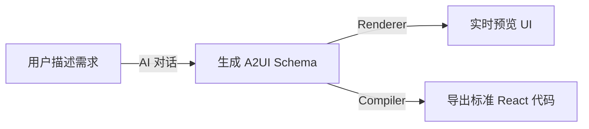

# A2UI 低代码平台 — 项目文档

> **最后更新时间**：2026-03-08
> **当前版本**：v0.2.5-alpha
> **架构状态**：2 包 Monorepo（frontend + backend）
> **完成度**：Sprint 3 Phase 0 完成，Phase 1 进行中

---

## 一、项目概览

这是一个基于 **Google A2UI（Agent to User Interface）协议** 的 **AI 驱动低代码平台**，采用精简的 2 包 Monorepo 架构。

| 包名                         | 定位                                        | 核心技术                            |
| ---------------------------- | ------------------------------------------- | ----------------------------------- |
| `@lowcode-platform/frontend` | 前端整合包（类型 + 渲染器 + 组件 + 编辑器） | React 18 + Zustand + Ant Design 5   |
| `@lowcode-platform/backend`  | 后端服务包（AI 服务 + 编译器）              | NestJS + Babel AST + 多 AI Provider |

**技术栈**：React 18 · TypeScript · Ant Design 5 · Vite · Zustand · NestJS · Anthropic/OpenAI/Ollama

**核心价值链**：



**差异化优势**：

- **遵循 Google A2UI 协议**：采用 [a2ui.org](https://a2ui.org) 开放协议的扁平 ID→Component 映射
- **AI 对话优先**：自然语言交互代替传统拖拽，对普通用户更便捷
- **双输出通道**：同一份 Schema 既可实时渲染预览，又可编译为标准 React 代码
- **企业级安全**：表达式沙箱 + URL 白名单 + 后端 API 鉴权

---

## 二、核心架构

### 2.1 Monorepo 结构

```
packages/
├── frontend/              # 前端整合包
│   ├── src/
│   │   ├── types/        # 类型定义 (Schema + DSL + Property Panel)
│   │   ├── renderer/     # 运行时渲染引擎 (DSL 执行器 + 表达式解析器)
│   │   ├── components/   # UI 组件库 (21 个组件元数据)
│   │   ├── editor/       # 编辑器 (AI 助手 + 属性面板 + 组件树)
│   │   └── styles/       # 统一样式
│   └── package.json
│
└── backend/               # 后端服务包
    ├── src/
    │   ├── modules/
    │   │   ├── ai/       # AI 服务 (多 Provider 支持 + Prompt Builder)
    │   │   └── compiler/ # 编译器 (Schema → React 代码，Babel AST)
    │   ├── common/       # 通用模块 ( guards, filters, interceptors)
    │   ├── config/       # 配置文件
    │   └── main.ts
    └── package.json
```

### 2.2 A2UI Schema 设计

**核心数据结构** (`packages/frontend/src/types/schema.ts`):

```typescript
interface A2UIComponent {
  id: string; // 唯一组件 ID
  type: string; // 组件类型（如 "Button", "Input"）
  props?: Record<string, any>; // 静态属性
  childrenIds?: string[]; // 子组件 ID 列表
  events?: Record<string, ActionList>; // 事件 → DSL Action 序列
}

interface A2UISchema {
  version?: number; // Schema 版本号（默认 1）
  rootId: string; // 根节点 ID
  components: Record<string, A2UIComponent>; // 扁平组件池
}
```

**Schema 优点**：

- 扁平结构 → O(1) 组件查找效率
- LLM 友好 → 声明式 JSON 格式，大模型可直接生成
- 安全 → 传输声明式数据而非可执行代码
- 版本化 → 已具备 `version` 字段，为未来迁移预留

### 2.3 DSL 执行引擎

**10 种核心 Action**，覆盖 90% 低代码场景：

| 分类       | Action         | 说明            |
| ---------- | -------------- | --------------- |
| **数据**   | `setValue`     | 设置字段/状态值 |
| **网络**   | `apiCall`      | API 请求        |
| **路由**   | `navigate`     | 页面跳转        |
| **交互**   | `feedback`     | 消息/通知       |
| **弹窗**   | `dialog`       | 模态框/确认框   |
| **控制**   | `if`           | 条件分支        |
| **控制**   | `loop`         | 循环遍历        |
| **工具**   | `delay`        | 延迟执行        |
| **工具**   | `log`          | 控制台日志      |
| **逃生舱** | `customScript` | 自定义脚本      |

---

## 三、组件库（21 个带元数据）

### 3.1 元数据系统

每个组件可选配 `.meta.ts` 文件，定义属性面板的配置 Schema：

```typescript
// Button.meta.ts 示例
export const ButtonMeta: ComponentPanelConfig = {
  componentType: 'Button',
  displayName: '按钮',
  category: 'form',
  properties: [
    {
      key: 'type',
      label: '类型',
      editor: 'select',
      options: [
        { label: '默认', value: 'default' },
        { label: '主要', value: 'primary' },
      ],
    },
    { key: 'children', label: '按钮文字', editor: 'string', defaultValue: '按钮' },
    { key: 'disabled', label: '禁用', editor: 'boolean', defaultValue: false },
  ],
};
```

### 3.2 组件清单

| 分类             | 组件（✅ = 有元数据）                                                                                               |
| ---------------- | ------------------------------------------------------------------------------------------------------------------- |
| **表单 (10)**    | ✅ Button, ✅ Input, ✅ TextArea, ✅ InputNumber, ✅ Select, ✅ Checkbox, ✅ Radio, ✅ Switch, ✅ Form, ✅ FormItem |
| **布局 (4)**     | ✅ Container, ✅ Space, ✅ Divider, Div                                                                             |
| **数据展示 (4)** | ✅ Card, ✅ Table, ✅ Tabs, List                                                                                    |
| **反馈 (3)**     | ✅ Modal, ✅ Alert, ✅ Typography                                                                                   |
| **其他**         | Text, ✅ Title, Slider, Collapse, Progress, Badge, Tag 等                                                           |

---

## 四、安全特性

### 4.1 表达式沙箱（前端）

- ✅ **jsep AST 解析器**：替代 `new Function()`，仅支持安全的表达式求值
- ✅ **白名单全局对象**：只暴露 Math, JSON, Date 等安全对象
- ✅ **原型链保护**：拦截 `__proto__`, `prototype`, `constructor` 访问
- ✅ **多语句拒绝**：Compound 节点只执行第一个表达式

### 4.2 编译器安全（后端）

- ✅ **表达式路径白名单验证** (`isValidExpressionPath`)：只允许合法的标识符和属性访问
- ✅ **URL 开放重定向防护** (`sanitizeUrl`)：拒绝 `javascript:`, `data:` 等危险协议，支持域名白名单
- ✅ **Babel AST 代码生成**：从根源消除 XSS 注入风险

### 4.3 后端防护

| 安全措施          | 状态 | 说明                                        |
| ----------------- | ---- | ------------------------------------------- |
| Bearer Token 认证 | ✅   | 所有 AI 接口已启用 `AuthGuard`              |
| API Key 过滤      | ✅   | `sanitizeModel()` 移除响应中的密钥          |
| 限流保护          | ✅   | 双层限流（10 次/秒、100 次/分钟）           |
| CORS 控制         | ✅   | 环境变量驱动，未配置时禁止跨域              |
| REST 规范         | ✅   | DELETE 方法已修正为 `@Delete("models/:id")` |

---

## 五、AI 集成

### 5.1 前后端分离架构

```
用户 → AI 助手 (浮动岛 Cmd+K) → ServerAIService → NestJS Server → AI Provider
```

- **前端层**：`ServerAIService` 作为纯 API 客户端，浏览器端不暴露 API Key
- **后端层**：`AIProviderFactory` 工厂模式管理多 Provider
- **流式输出**：RxJS Observable + SSE 实现流式聊天

### 5.2 支持的 AI Provider

| Provider           | 状态 | 配置项                                 |
| ------------------ | ---- | -------------------------------------- |
| OpenAI             | ✅   | `OPENAI_API_KEY`, `OPENAI_MODEL`       |
| Anthropic (Claude) | ✅   | `ANTHROPIC_API_KEY`, `ANTHROPIC_MODEL` |
| Ollama (本地)      | ✅   | `OLLAMA_BASE_URL`, `OLLAMA_MODEL`      |
| 自定义兼容服务     | ✅   | 支持 SiliconFlow, DeepSeek, Azure 等   |

### 5.3 Prompt 工程化

`PromptBuilder` 自动注入：

- 核心 Action 类型说明（10 种）
- 可用组件类型白名单（从注册表自动生成）
- Schema 格式规范
- 输出要求（纯 JSON，无 Markdown）

---

## 六、编译器（后端）

### 6.1 架构设计

Compiler 已迁移至后端 (`packages/backend/src/modules/compiler/`)，解决浏览器兼容性和安全问题。

**API 端点**：

```
POST /api/v1/compiler/export
Request: { schema: A2UISchema, options?: CompileOptions }
Response: { code: string }
```

### 6.2 编译流程

```
A2UI Schema → generator.ts (入口)
           → jsxBuilder.ts (JSX AST 生成)
           → actionBuilder.ts (事件函数 AST)
           → styleCompiler.ts (样式 → Tailwind)
           → Babel 生成代码 → Prettier 格式化 → 返回
```

### 6.3 编译特性

- ✅ **全局 Field 收集**：一次遍历提取所有 `useState`，避免条件性 Hook 调用
- ✅ **循环引用检测**：`visited` Set 标记，生成注释而非报错
- ✅ **样式双轨输出**：可映射的转 Tailwind className，复杂值保留内联 style
- ✅ **中文保护**：`jsescOption.minimal: true` 防止中文被转义为 Unicode

---

## 七、编辑器功能

### 7.1 核心功能

| 功能        | 状态 | 说明                                                  |
| ----------- | ---- | ----------------------------------------------------- |
| AI 对话生成 | ✅   | 浮动岛 (Cmd+K) + 历史抽屉 (Alt+H)                     |
| 实时预览    | ✅   | SelectableCanvas 支持画布选中                         |
| 组件树      | ✅   | TreeView + 右键菜单（删除/复制/上移/下移）            |
| 属性面板    | ✅   | 根据元数据动态生成 5 种编辑器类型                     |
| Undo/Redo   | ✅   | Command Pattern，50 步历史                            |
| 模板库      | ✅   | 5 个内置模板（Dashboard, Login, Form, List, Profile） |
| 错误处理    | ✅   | ErrorBoundary + EmptyState，5 种预设变体              |
| Schema 校验 | ✅   | SchemaValidator + autoFix 自动修复                    |

### 7.2 属性面板编辑器类型

| 类型      | 说明        | 适用场景               |
| --------- | ----------- | ---------------------- |
| `string`  | 文本输入框  | 按钮文字、占位符等     |
| `number`  | 数字输入框  | 行数、最大值、最小值等 |
| `boolean` | Switch 开关 | 禁用、加载、必填等     |
| `select`  | 下拉选择    | 类型、尺寸、颜色等     |
| `color`   | 颜色选择器  | 主题色、背景色等       |
| `json`    | JSON 编辑器 | 复杂对象配置           |

---

## 八、测试覆盖

| 包       | 框架   | 单元测试 | E2E | 说明                              |
| -------- | ------ | -------- | --- | --------------------------------- |
| frontend | Vitest | ✅       | ❌  | Engine, Actions, Parser 覆盖      |
| backend  | Jest   | ✅       | ✅  | Factory, Service, Controller 覆盖 |

**关键测试文件**：

- `renderer/__tests__/` — DSL 引擎测试（24 种 Action）
- `renderer/executor/__tests__/` — 表达式解析器安全沙箱测试
- `editor/store/__tests__/` — Zustand 状态管理测试
- `backend/src/modules/ai/` — Service + Controller 测试

---

## 九、工程化现状

### 9.1 已配置工具

| 工具        | 状态 | 文件位置                          |
| ----------- | ---- | --------------------------------- |
| ESLint      | ✅   | `eslint.config.mjs` (flat config) |
| Prettier    | ✅   | `.prettierrc.json`                |
| Husky       | ✅   | `.husky/` 目录                    |
| lint-staged | ✅   | `package.json` 配置               |

### 9.2 待完成

| 工具              | 优先级 | 说明                             |
| ----------------- | ------ | -------------------------------- |
| GitHub Actions CI | P2     | build + test + type-check 流水线 |
| Commitlint        | P3     | 提交消息规范                     |
| Changesets        | P3     | 版本管理和发布                   |

---

## 十、综合评分

| 维度       | 评分 (1-10) | 说明                                           |
| ---------- | :---------: | ---------------------------------------------- |
| 架构设计   |    **9**    | 2 包精简架构，依赖清晰，维护轻松               |
| 功能完整度 |   **8.5**   | DSL 引擎强大，属性面板已实现，模板库待完善     |
| 代码质量   |    **7**    | 注释详尽，但 `any` 过度使用                    |
| 安全性     |    **9**    | 表达式沙箱 + 编译器安全 + 后端鉴权             |
| 测试覆盖   |   **8.5**   | 单元测试基建覆盖，E2E 待加强                   |
| 工程化     |    **7**    | ESLint + Prettier + Husky 已配置，CI/CD 待建设 |
| AI 集成    |   **8.5**   | 多 Provider 流式输出，Schema 校验闭环          |
| 开发体验   |    **8**    | AGENT.md 优秀，2 包架构简化维护                |
| **综合**   |   **8.5**   | **安全基线达标 + 架构精简 + 核心功能完备**     |

---

## 十一、优先改进建议

| 优先级 | 任务                         |   状态    | 预计工作量 |
| :----: | ---------------------------- | :-------: | :--------: |
| **P0** | ~~安全加固（表达式 + URL）~~ | ✅ 已完成 |     -      |
| **P0** | ~~架构重构（6 包→2 包）~~    | ✅ 已完成 |     -      |
| **P0** | ~~编译器迁移后端~~           | ✅ 已完成 |     -      |
| **P1** | ~~组件属性元数据（21 个）~~  | ✅ 已完成 |     -      |
| **P1** | 类型攻坚（消灭 `any`）       |    ⏳     |    1 天    |
| **P1** | 模板库完善（5→8 个）         |    ⏳     |    1 天    |
| **P1** | Demo 站点部署（Vercel）      |    ⏳     |   1-2 天   |
| **P1** | README.md 重写               |    ✅     |     -      |
| **P2** | GitHub Actions CI            |    ⏳     |   0.5 天   |
| **P2** | P1 批次组件元数据补充        |    ⏳     |    2 天    |

---

## 十二、快速开始

### 安装与运行

```bash
# 克隆项目
git clone https://github.com/your-org/a2ui-lowcode.git
cd a2ui-lowcode

# 安装依赖
pnpm install

# 启动开发服务器
pnpm dev

# 访问 http://localhost:5173
```

### 常用命令

```bash
# 构建
pnpm build            # 全量构建
pnpm build:frontend   # 仅前端
pnpm build:backend    # 仅后端

# 代码质量
pnpm lint             # ESLint 检查
pnpm lint:fix         # 自动修复
pnpm format           # Prettier 格式化

# 测试
pnpm test             # 运行测试
```

---

**文档更新时间**：2026-03-08 · **Sprint 3 Phase 0 全部完成** · 下一步：Phase 1 开源首发准备
