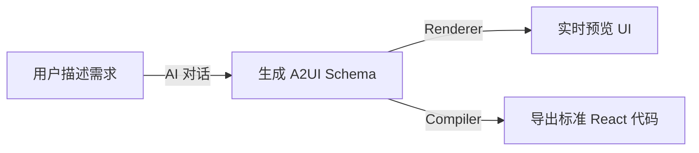
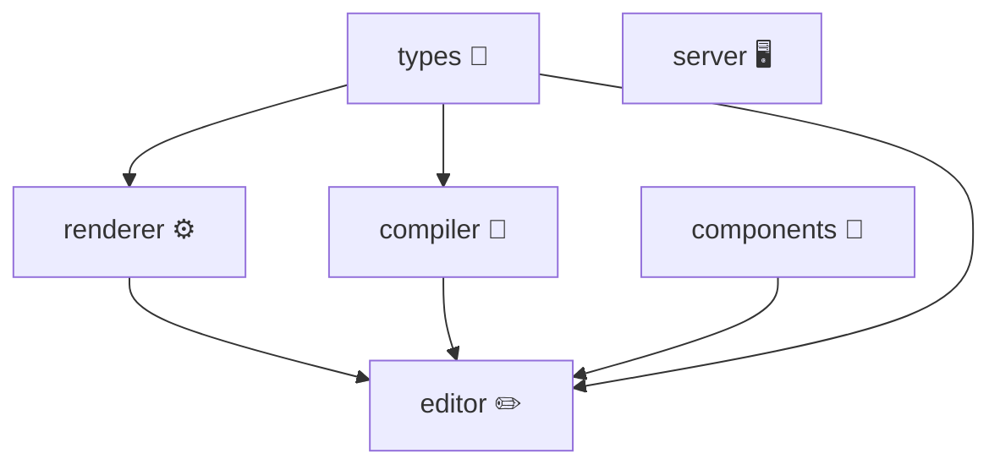
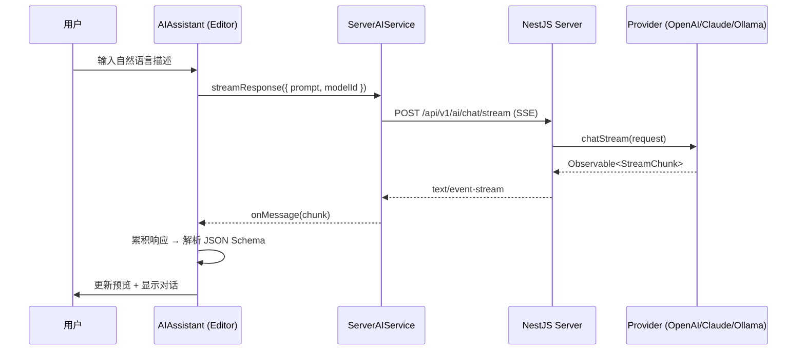

# 低代码 AI 平台项目总结

## 一、项目概览

这是一个基于 **Google A2UI（Agent to User Interface）协议** 的 **AI 驱动低代码平台**，采用 pnpm monorepo 架构，包含 **6 个核心包** 和 1 个示例应用：

| 包名         | 定位                     | 核心技术                       |
| ------------ | ------------------------ | ------------------------------ |
| `types`      | 共享类型（Schema + DSL） | 纯 TypeScript 类型定义         |
| `renderer`   | 运行时渲染引擎           | React 18 + Redux Toolkit + Zod |
| `components` | UI 组件库                | Ant Design 5 封装（47 组件）   |
| `compiler`   | Schema → 代码编译器      | Babel AST 代码生成             |
| `editor`     | 编辑器 + AI 助手         | Monaco Editor + AI 对话        |
| `server`     | 后端 AI 服务             | NestJS + 多 AI Provider        |

**技术栈全景**：React 18 · TypeScript · Ant Design 5 · Vite · Redux Toolkit · Zod · Monaco Editor · NestJS · Anthropic/OpenAI/Ollama

**核心价值链**：



**差异化优势**：

- **遵循 Google A2UI 协议**：采用 [A2UI](https://a2ui.org) 开放协议的扁平 ID→Component 映射（v0.8 稳定 / v0.9 草案，目标 Q4 2026 v1.0），专为 LLM 生成优化
- **AI 对话优先**：以自然语言交互代替传统拖拽范式，对普通用户更便捷
- **双输出通道**：同一份 Schema 既可运行时渲染预览，又可编译为标准 React 代码导出
- **DSL 执行引擎**：内置 7 大类 24 种 Action，支持流程控制、异步编排，远超一般低代码平台

---

## 二、架构分析

### 2.1 Monorepo 结构

采用 pnpm workspace 管理，包的划分遵循 **关注点分离** 原则。依赖关系为：



> [!TIP]
> 包之间的依赖方向清晰，没有循环依赖。`types` 作为独立的共享类型包被所有前端包通过 `workspace:*` 引用，这是正确的抽取决策。

**已知问题**：

- `examples/playground` 未纳入 `pnpm-workspace.yaml`，无法享受 workspace 协议
- 根 `package.json` 中存在冗余的运行时依赖（`@reduxjs/toolkit`、`react-redux`），应下沉到 `renderer` 包
- `components` 包的 `react`/`antd` 同时在 `dependencies` 和 `peerDependencies` 中声明，可能导致多实例问题

### 2.2 Schema 设计（Google A2UI Protocol）

> [!IMPORTANT]
> **协议来源**：A2UI（Agent to User Interface）是 **Google 于 2025-2026 年提出的开放协议**，定义了 AI Agent 向客户端声明式描述 UI 的标准格式。官网 [a2ui.org](https://a2ui.org)。
>
> 本项目是对 A2UI 协议的前端实现方案，覆盖了协议的核心数据模型（扁平组件列表 + ID 引用），并在其基础上扩展了 DSL 事件系统。

核心数据结构（`packages/types/src/schema.ts`）：

```typescript
interface A2UIComponent {
  id: string;
  type: string; // 组件类型
  props?: Record<string, any>; // 静态属性
  childrenIds?: string[]; // 子节点 ID 列表
  events?: Record<string, ActionList>; // 事件 → DSL Action 序列（项目扩展）
}

interface A2UISchema {
  version?: number; // Schema 版本号（默认 1）
  rootId: string; // 根节点 ID
  components: Record<string, A2UIComponent>; // 扁平组件池
}
```

**优点**：

- 扁平结构使组件查找为 O(1)，天然支持拖拽、移动等编辑操作
- LLM 友好：声明式 JSON 格式，大模型可直接生成
- 安全：传输声明式数据而非可执行代码
- 已具备 `version` 字段，为未来 Schema 迁移预留基础设施

**Zod 运行时校验**：renderer 包已引入 `zod`（`packages/renderer/src/utils/schema-validator.ts`），实现了三层校验：

1. `validateSchema()` — 严格模式，校验失败直接抛错
2. `safeValidateSchema()` — 安全模式，返回 `{ success, data/error }`
3. `validateSchemaWithWhitelist()` — 白名单模式，校验组件类型是否已注册

校验逻辑包含 **引用完整性检查**（rootId 有效、childrenIds 无悬挂引用）。

**不足**：

- `props: Record<string, any>` 类型安全不足
- 缺少组件属性元数据（Property Panel Schema），无法自动生成可视化属性配置面板——这是当前可视化编辑能力的**核心短板**

### 2.3 DSL 执行引擎

`renderer` 包内置完整的 DSL 执行引擎（`packages/renderer/src/executor/`），支持 24 种 Action，分布在 8 个模块中：

| Action 分类 | 包含操作                                       | 模块文件              |
| ----------- | ---------------------------------------------- | --------------------- |
| 数据操作    | setField, mergeField, clearField               | `dataActions.ts`      |
| UI 交互     | message, modal, confirm, notification          | `uiActions.ts`        |
| 导航        | navigate, openTab, closeTab, back              | `navActions.ts`       |
| 状态管理    | dispatch, setState, resetForm                  | `stateActions.ts`     |
| 异步操作    | apiCall, delay, waitCondition                  | `asyncActions.ts`     |
| 流程控制    | if, switch, loop, parallel, sequence, tryCatch | `flowActions.ts`      |
| 调试        | log, debug                                     | `debugActions.ts`     |
| 扩展        | customScript, customAction                     | `extensionActions.ts` |

**亮点**：

- **注册表模式**（`ActionRegistry`），可扩展自定义 Action
- 执行上下文（`ExecutionContext`）内置 http 工具、uuid、debounce/throttle 等
- 支持嵌套 Action（如 tryCatch 内的 onError、apiCall 的 onSuccess/onError）

**隐患**：

- `dsl.ts` 长达 552 行，所有 Action 类型堆在一个文件中
- `ExecutionContext` 接口约 100 行的属性定义，职责庞大
- loop 的无限循环风险缺少引擎层面安全限制

---

## 三、安全性分析

### 3.1 表达式解析器

表达式解析器（`expressionParser.ts`）是安全性的关键节点：

**已做的安全措施**：

- Proxy 沙箱（`createSandbox`），拦截对全局对象的访问
- 静态安全校验（`validateSafety`），拦截 `eval`、`Function`、`import` 等危险操作
- `with` 语句 + Proxy `has` trap 实现变量隔离
- AST 验证器（`astValidator.ts`）基于正则的危险模式检测

**仍存在的风险**：

- 底层仍使用 `new Function()` 执行动态代码，这是根本性安全隐患
- 黑名单式的安全校验容易被绕过
- `validateWithAST()` 标注 TODO 未实现，深度 AST 验证缺失

> [!CAUTION]
> 表达式引擎使用 `new Function()` 动态执行用户输入，即使有 Proxy 沙箱保护，仍然是**最高优先级的安全风险**。建议替换为 QuickJS WASM 或白名单 AST 解析器。

### 3.2 服务端安全

| 项目         | 状态 | 说明                                                                 |
| ------------ | :--: | -------------------------------------------------------------------- |
| DTO 校验     |  ✅  | ValidationPipe whitelist + forbidNonWhitelisted                      |
| 异常过滤     |  ✅  | HttpExceptionFilter 统一异常处理                                     |
| 限流         |  ✅  | @nestjs/throttler 双层限流（10次/秒、100次/分钟）                    |
| CORS         |  ⚠️  | 已改为环境变量驱动（未配置时禁止跨域），但 `.env.example` 仍建议 `*` |
| API 鉴权     |  ❌  | 完全缺失，任何人可调用 AI 接口消耗 Token                             |
| API Key 暴露 |  ❌  | `/ai/providers/status` 接口返回 config 含 apiKey                     |
| `.env` 管理  |  ✅  | 仅有 `.env.example`（良好实践），未将 `.env` 纳入版本控制            |
| DELETE 方法  |  ⚠️  | 删除模型使用 `@Get("models/:id/delete")`，违反 RESTful 规范          |

---

## 四、AI 集成分析

### 4.1 架构设计

AI 集成采用清晰的**前后端分离架构**：



- **前端层**：`ServerAIService` 作为纯 API 客户端，彻底消除了浏览器端暴露 API Key 的隐患
- **后端层**：`AIProviderFactory` 工厂模式管理多 Provider，支持 OpenAI、Anthropic、Ollama 及自定义兼容 Provider
- **流式输出**：使用 RxJS Observable + SSE 实现流式聊天

### 4.2 Prompt 策略

Schema 生成使用独立配置（`packages/server/src/config/ai.config.ts`）：低温度（0.2）确保输出一致性，最大 Token 8192，System Prompt 指导生成 A2UI 格式 JSON。

### 4.3 编辑器 AI 功能

- 支持多轮对话（`conversationHistory` 数组）
- 当前 Schema 作为上下文传入
- 预设问题建议（`suggestions`）
- 编辑器支持 Undo/Redo（`useSchemaHistory`：500ms 防抖合并，最大 50 步历史）
- 草稿自动保存（`useDraftStorage`：localStorage 持久化）

### 4.4 不足之处

- **AI 生成 Schema 未经 Zod 校验**：解析后直接注入编辑器，应增加 `safeValidateSchema()` 校验步骤
- 缺少 fallback 机制（首选 Provider 不可用时不自动切换）
- 无 token 计费、配额管理、对话历史持久化等生产级功能
- 对话上下文无限增长可能超出模型窗口

---

## 五、组件库分析

### 5.1 组件覆盖度

封装了 **31 个 Ant Design 组件文件**，注册表包含 **47 个组件/子组件**（`packages/components/src/index.tsx`），覆盖布局、表单、数据展示、反馈、排版五大类。

### 5.2 设计问题

- `dependencies` 和 `peerDependencies` 双重声明 `react`/`antd`，应只保留 `peerDependencies`
- 注册表硬编码，新增组件需修改 `index.tsx` 两处（export + registry）
- 所有组件注册为 `React.ComponentType<any>`，丧失类型提示
- **缺少组件属性元数据**（Property Panel Schema），无法在可视化编辑器中自动生成属性配置面板——这是当前最大的功能缺口

---

## 六、编译器分析

`compiler` 包将 A2UI Schema 编译为 React 组件源代码，基于 **Babel AST** 架构，由 4 个子模块组成：

| 模块               | 行数    | 职责                           |
| ------------------ | ------- | ------------------------------ |
| `generator.ts`     | 108 行  | 编译入口、状态收集、AST 组装   |
| `jsxBuilder.ts`    | 251 行  | 递归生成 JSX Element AST       |
| `actionBuilder.ts` | ~200 行 | DSL Action → 箭头函数 AST      |
| `styleCompiler.ts` | 170 行  | CSS-in-JS → Tailwind className |

**亮点**：

- 全面采用 `@babel/types` 驱动代码生成，从根源消除 XSS 注入风险
- 全局 Field 收集 → 一次遍历提取所有 `useState`，避免条件性 Hook 调用
- 循环引用检测（`visited` Set）→ 生成注释标记而非报错
- 样式双轨输出：可映射的转 Tailwind className，复杂值保留内联 style
- 配置 `jsescOption.minimal: true` 防止中文被转义为 Unicode
- DSL `ActionList` 事件可编译为 React 箭头函数包裹器

**局限**：

- 目标锁定 React + antd，不支持多框架输出（Vue、小程序等）
- 不生成 TypeScript（仅 JSX）
- 固定组件名 `GeneratedPage`，不支持自定义

---

## 七、后端架构评估

### 7.1 项目结构

NestJS 标准结构，全局前缀 `/api/v1`，核心模块为 `ai`（controller / service / providers / dto / model-config）。

### 7.2 API 路由

| Method | Route                        | 说明              |
| ------ | ---------------------------- | ----------------- |
| POST   | `/ai/chat`                   | 非流式聊天        |
| POST   | `/ai/chat/stream`            | SSE 流式聊天      |
| POST   | `/ai/generate-schema`        | Schema 生成       |
| POST   | `/ai/generate-schema/stream` | 流式 Schema 生成  |
| GET    | `/ai/providers`              | Provider 列表     |
| GET    | `/ai/providers/status`       | Provider 健康状态 |
| GET    | `/ai/models`                 | 模型配置列表      |
| POST   | `/ai/models`                 | 保存模型配置      |
| POST   | `/ai/models/delete`          | 删除模型          |

### 7.3 后端问题诊断

1. **DELETE 用 GET**：`@Get("models/:id/delete")` 违反 RESTful，系 AI 辅助生成遗留的调试代码
2. **文件持久化**：`model-config.service.ts` 直接读写 `ai-models.json`，在容器化/多实例场景不适用
3. **Provider 状态暴露 apiKey**：`getAllProviderStatus()` 返回 config 含密钥
4. **无 API 鉴权**：所有路由无认证，任何人可消耗 Token 额度
5. **SSE 重复代码**：`chatStream()` 和 `generateSchemaStream()` 约 50 行近乎相同的 SSE 处理逻辑
6. **前后端类型未共享**：前端手动定义 `AIRequest`/`AIResponse`，与后端 `ChatRequest`/`ChatResponse` 不同步

---

## 八、测试覆盖度

| 包         | 框架   | 单元测试  |   E2E    | 说明                              |
| ---------- | ------ | :-------: | :------: | --------------------------------- |
| types      | -      |     -     |    -     | 纯类型文件，无需测试              |
| renderer   | Vitest | ✅ 10文件 |    ❌    | Engine、Actions、Parser 全覆盖    |
| compiler   | Vitest | ✅ 2文件  |    ❌    | AST 编译测试                      |
| components | Vitest | ✅ 2文件  |    ❌    | 注册表 + 基础渲染                 |
| editor     | Vitest | ✅ 3文件  |    ❌    | 组件渲染 Mock 测试                |
| server     | Jest   | ✅ 4文件  | ✅ 3文件 | Factory/Service/Controller 全覆盖 |

> [!NOTE]
> 前端使用 Vitest（契合 Vite），后端使用 Jest（NestJS 默认），各自生态的最佳实践。renderer 的测试质量最高，覆盖了 DSL 引擎核心（24 种 Action）、表达式解析器安全沙箱、Schema 校验等关键路径。

---

## 九、工程化与开发体验

### 9.1 做得好的方面

- `AGENT.md` 文件 208 行，为 AI 辅助开发提供充足上下文
- `tsconfig.base.json` 严格模式（`strict: true`、`noUnusedLocals`、`noUnusedParameters`）
- `pnpm dev` 一键启动 playground
- 构建脚本合理，支持单包与全量构建
- 各包构建工具适配：前端用 Vite library mode（ESM + .d.ts），后端/types 用 `tsc`

### 9.2 工程化缺失

| 工具                       | 状态 | 影响               |
| -------------------------- | :--: | ------------------ |
| ESLint                     |  ❌  | 代码规范无强制保证 |
| Prettier                   |  ❌  | 格式不统一         |
| .editorconfig              |  ❌  | 编辑器配置不统一   |
| Husky / lint-staged        |  ❌  | 提交质量无保障     |
| CI/CD (GitHub Actions)     |  ❌  | 无自动化构建/测试  |
| Commitlint                 |  ❌  | 提交消息无规范     |
| Changesets / Lerna version |  ❌  | 版本管理手动       |

### 9.3 文档问题

- `README.md` 的 Schema 格式说明与实际 A2UI 扁平格式不一致（README 描述嵌套树结构）
- `AGENT.md` 未列出 `types` 和 `server` 包

---

## 十、扩展性与可维护性

### 10.1 三层可扩展性

| 层级   | 扩展点          | 机制                              |
| ------ | --------------- | --------------------------------- |
| 组件层 | 自定义 UI 组件  | `componentRegistry` 注入          |
| DSL 层 | 自定义 Action   | `executor.registerHandler()`      |
| AI 层  | 自定义 Provider | `AIProviderFactory` + OpenAI 兼容 |

### 10.2 欠缺的扩展能力

- ❌ **组件属性面板元数据**：核心缺口，无法自动生成属性配置面板
- ❌ 插件系统 / 微内核：组件注册全量硬编码，无按需加载
- ❌ 主题定制：仅依赖 Ant Design ConfigProvider
- ❌ 多目标编译：Compiler 锁定 React + antd
- ❌ 组件 Marketplace：无远程组件加载

### 10.3 可维护性

- 中文注释覆盖率高，团队内可读性好
- 类型定义较完整，但 `any` 使用过于频繁
- 部分文件过长（`dsl.ts` 552 行、`Renderer.tsx` 443 行、`expressionParser.ts` 422 行），建议拆分

---

## 十一、总结

### ⭐ 核心优点

1. **协议选型正确** — 遵循 Google A2UI 开放协议，与 AI 原生 UI 生成的业界标准方向一致
2. **架构设计合理** — Monorepo 6 包分层清晰，依赖方向正确，关注点分离优秀
3. **AI 对话优先的交互范式** — 对普通用户比传统拖拽更便捷，自然语言描述即可生成页面
4. **DSL 引擎功能丰富** — 7 大类 24 种 Action，具备流程控制、异步编排、错误处理等高级能力
5. **AST 编译器成熟** — Babel AST 管线，从根源消除 XSS 注入风险，支持 Tailwind 样式编译
6. **Zod 运行时校验完善** — 三层校验 + 引用完整性检查，编辑器实时容错与编译时严格校验双轨并行
7. **AI 架构安全** — 前端已移除直连大模型逻辑，API Key 统一由后端管理

### ⚠️ 核心问题

1. **安全隐患残留** — 表达式引擎底层仍使用 `new Function()`，Proxy 沙箱 + 黑名单机制防不住恶意绕过
2. **后端安全缺失** — 无 API 鉴权、Provider 状态接口暴露 apiKey、DELETE 操作使用 GET
3. **组件属性面板缺失** — 用户无法对 AI 生成的单个组件微调配置，只能通过再次对话或手动编辑 JSON
4. **类型安全不足** — 核心数据结构和组件注册表大量使用 `any`
5. **工程化极简主义** — 无 Lint、无格式化、无 Git Hooks、无 CI/CD
6. **AI Schema 校验断裂** — AI 生成的 Schema 未经 `safeValidateSchema()` 校验就注入编辑器

### 📊 综合评分

| 维度       | 评分 (1-10) | 说明                                                                    |
| ---------- | :---------: | ----------------------------------------------------------------------- |
| 架构设计   |    **8**    | 6 包分层清晰，AI 协议选型正确，前后端职责明确                           |
| 功能完整度 |    **8**    | DSL 引擎强大，编译器 AST 架构成熟，双输出通道完备                       |
| 代码质量   |    **7**    | 注释详尽，模块拆分合理，但 `any` 过度使用                               |
| 安全性     |    **6**    | 编译器 XSS 已根除，但运行时沙箱和后端鉴权均有漏洞                       |
| 测试覆盖   |   **8.5**   | 全包测试基建覆盖，renderer/server 高质量，compiler 已对齐               |
| 工程化     |    **3**    | 基建几乎全无，严重依赖工程师自觉                                        |
| AI 集成    |    **8**    | 多 Provider 流式输出，前后端分离安全，缺 Schema 输出校验                |
| 开发体验   |    **7**    | AGENT.md 优秀，构建脚本合理，缺代码检查工具                             |
| **综合**   |   **7.0**   | **协议选型前瞻 + 核心引擎扎实，补齐安全/属性面板/工程化后具备开源潜力** |

### 🎯 优先改进建议

1. **P0 — 安全深水区**：彻底废除 `new Function()`，引入或自研真正的白名单 AST 解析引擎（如基于 JS-Interpreter）。
2. **P1 — 编译器架构升级（端云分离）**：将 `compiler` 的代码生成动作从纯前端迁移至后端 Node.js 服务端（向 Editor 提供导出接口）。作为“按需出码”的云端服务，彻底解决浏览器运行 `@babel/types` 等构建工具库引发的环境兼容问题（如 `process is not defined`）与前端包体积膨胀问题。
3. **P1 — 类型攻坚战**：逐步剔除 `any`，为组件 props 定义精确的 TypeScript 接口，同时引入 Zod 构建严密的运行时校验。
4. **P2 — 补充自动化流**：目前已建立各包基础测试覆盖，下一步重点是接通 CI（GitHub Actions）实现合并主分支的防劣化校验。
5. **P2 — 研发基建**：花半天时间引入 ESLint + Prettier + husky + lint-staged，终结代码风格争议。
   | 优先级 | 建议 |
   | :----: | -------------------------------------------------------------------------------------- |
   | **P0** | 安全加固：废除 `new Function()`（替换为 QuickJS WASM）、后端增加 API 鉴权、过滤 apiKey |
   | **P1** | AI Schema 闭环：注入前增加 `safeValidateSchema()` 校验 |
   | **P1** | 组件属性元数据：为每个组件定义 Property Panel Schema，支持可视化属性配置 |
   | **P1** | 类型攻坚：逐步消除 `any`，为组件 props 定义精确 TypeScript 接口 |
   | **P2** | 工程化基建：ESLint + Prettier + Husky + lint-staged（半天可完成） |
   | **P2** | CI/CD：GitHub Actions 配置 build + test + type-check 流水线 |
   | **P3** | 多目标编译：Compiler 支持 Vue、小程序等输出 |
   | **P3** | 实时协作：基于 CRDT 的多人 Schema 协同编辑 |
